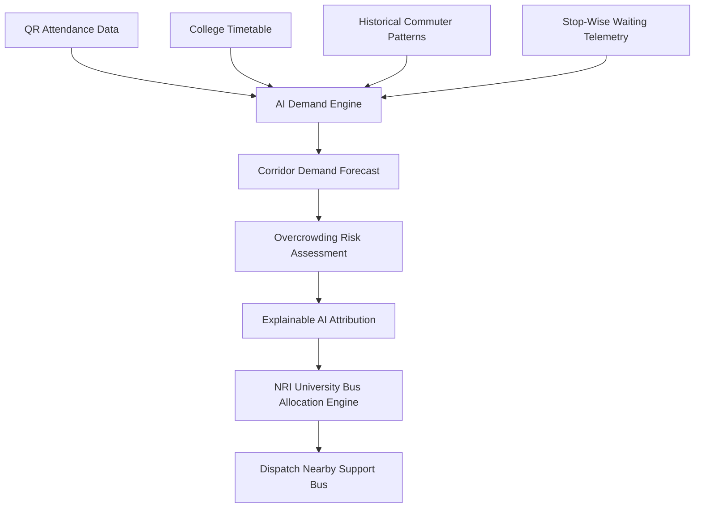

# NRI University Bus — AI-Powered College Bus Overcrowding & Demand Prediction System

> **Institution:**  
> **NRI Institute of Technology (NRIIT)**  
> Pothavarappadu, Via Nunna, Vijayawada, Andhra Pradesh — 521212  
> **Environment:** Official Pilot Environment • NRI Institute of Technology  
> **Disclaimer:** Prototype • Simulated Transport & Attendance Data  

---

## 📌 Table of Contents
1. [Executive Summary](#executive-summary)
2. [Core Problem Statement](#core-problem-statement)
3. [The AI-Driven Solution](#the-ai-driven-solution)
4. [Attendance-to-Transit Pipeline (Core Innovation)](#attendance-to-transit-pipeline-core-innovation)
5. [Route-First Architecture](#route-first-architecture)
6. [QR Attendance & Security Protocol](#qr-attendance--security-protocol)
7. [AI Prediction Model & Explainable AI (XAI)](#ai-prediction-model--explainable-ai-xai)
8. [NRI University Bus Allocation Engine](#nri-university-bus-allocation-engine)
9. [12-Step Hackathon Demonstration Flow](#12-step-hackathon-demonstration-flow)
10. [Database Schema (Supabase Compatible)](#database-schema-supabase-compatible)
11. [Technology Stack](#technology-stack)
12. [Project File Structure](#project-file-structure)
13. [Setup & Execution Guide](#setup--execution-guide)
14. [Future Real-World Integration Scope](#future-real-world-integration-scope)
15. [Data Disclaimer](#data-disclaimer)

---

## 🚀 Executive Summary

**NRI University Bus** is an intelligent campus mobility and overcrowding management platform engineered exclusively for **NRI Institute of Technology (NRIIT)** in Vijayawada, Andhra Pradesh.

College transportation systems frequently suffer from uneven, volatile passenger demand across routes and stops. Morning lab attendance, examination schedules, and timetable dismissals create acute bottlenecks that static bus schedules cannot handle.

NRIIT has sufficient buses across its campus fleet under normal conditions. When a specific route approaches full capacity, the platform identifies predicted overflow and intelligently allocates nearby or standby NRIIT buses to relieve the corridor before students are stranded on the highway.

---

## 🎯 Core Problem Statement

> *“How can AI predict passenger demand and recommend better bus allocation based on attendance, timetable, and historical travel patterns?”*

### The Challenges:
- **Unpredictable Route Surges:** Key corridors (e.g. Mangalagiri to NRIIT) experience sudden student spikes at specific highway junctions (Kaza, Chinna Kakani).
- **Static Dispatch Blindspots:** Administrators only discover overcrowding *after* a bus is already full.
- **Disconnected Data Silos:** Classroom attendance data is rarely integrated with campus fleet operations.
- **Fleet Inefficiency:** While Route 1 overflows at 116% capacity, Route 3 runs at 49% utilization with 26 available seats.

---

## 💡 The AI-Driven Solution

The platform operates on a closed-loop intelligence architecture:

$$\text{PREDICT} \longrightarrow \text{DETECT} \longrightarrow \text{EXPLAIN} \longrightarrow \text{RECOMMEND} \longrightarrow \text{ALLOCATE}$$



---

## 🔄 Attendance-to-Transit Pipeline (Core Innovation)

Classroom presence is the most reliable leading indicator of campus travel volume:

$$\text{ATTENDANCE} \rightarrow \text{STUDENT COUNT} \rightarrow \text{DEMAND PREDICTION} \rightarrow \text{ROUTE DEMAND} \rightarrow \text{BUS CAPACITY} \rightarrow \text{AI ALERT} \rightarrow \text{RECOMMENDATION}$$

- **Attendance 70%** $\rightarrow$ Predicted Demand: 38 pax (76% load) $\rightarrow$ **SAFE**
- **Attendance 80%** $\rightarrow$ Predicted Demand: 44 pax (88% load) $\rightarrow$ **MODERATE**
- **Attendance 90%** $\rightarrow$ Predicted Demand: 52 pax (104% load) $\rightarrow$ **HIGH RISK**
- **Attendance 94%** $\rightarrow$ Predicted Demand: 58 pax (116% load) $\rightarrow$ **CRITICAL OVERCROWDING**
- **Attendance 98%** $\rightarrow$ Predicted Demand: 64 pax (128% load) $\rightarrow$ **SEVERE SURGE**

---

## 🛣️ Route-First Architecture

The system is strictly **Route-First**:
- Corridors are fixed operational routes; vehicles from the fleet are dynamically assigned based on real-time demand.
- In demo mode, all fleet entities are designated as **“Assigned Vehicle”** or **“Demo Vehicle”** (e.g., `veh-demo-a`, `veh-demo-d`).

### Configured Corridors for NRIIT:
1. **Route 1 — Mangalagiri to NRIIT (Primary Pilot Corridor):**
   - **Path:** NRI Institute of Technology $\rightarrow$ Pedda Kakani $\rightarrow$ Numbur $\rightarrow$ Koppuravuru $\rightarrow$ Kaza $\rightarrow$ Chinna Kakani $\rightarrow$ Tenali Bypass $\rightarrow$ Mangalagiri
   - **Assigned:** Assigned Vehicle A (`veh-demo-a`, 50 Seats)
   - **Status:** HIGH RISK (116% Predicted Occupancy)
2. **Route 2 — Vijayawada Benz Circle to NRIIT:**
   - **Path:** NRI Institute of Technology $\rightarrow$ Nunna $\rightarrow$ Kandrika $\rightarrow$ Gunadala $\rightarrow$ Ramavarappadu $\rightarrow$ Benz Circle
   - **Assigned:** Assigned Vehicle B (`veh-demo-b`, 55 Seats)
   - **Status:** MODERATE (80% Predicted Occupancy)
3. **Route 3 — Gannavaram Airport Corridor to NRIIT:**
   - **Path:** NRI Institute of Technology $\rightarrow$ Nunna Road $\rightarrow$ Enikepadu $\rightarrow$ Prasadampadu $\rightarrow$ Kesarapalle $\rightarrow$ Gannavaram
   - **Assigned:** Assigned Vehicle C (`veh-demo-c`, 45 Seats)
   - **Status:** SAFE (49% Predicted Occupancy, 26 Available Seats)

---

## 🔐 QR Attendance & Security Protocol

Attendance serves as the primary data trigger for AI demand forecasting.

### A. Faculty Mode (Generate QR):
- Faculty selects: Department (`CSE`), Year (`III`), Section (`A`), Subject (`Deep Learning & AI`), Period (`Period 1`), Expiry (`5–10 mins`).
- Generates an interactive cryptographic token (e.g. `NRIIT-ATT-2026-CSEA-9812`).
- Renders with a live countdown timer (`QR expires in 05:00`).
- Token automatically invalidates upon timeout.

### B. Student Mode (Scan QR):
- Mobile-friendly camera viewfinder with optical scanner emulator.
- Student authenticates using College Roll Number (e.g., `21NR1A0501`) and Name (`B. Sai Teja`).
- Validates token authenticity, session validity, and enrollment.
- Shows verified banner:
  > **✅ Attendance Marked**  
  > Student: B. Sai Teja (21NR1A0501) • Class: CSE-A • Time: 08:42 AM • Status: Present
- **Duplicate Prevention:** Rejects duplicate scans by the same student for the same session.

---

## 🧠 AI Prediction Model & Explainable AI (XAI)

- **Model Type:** Scikit-Learn `RandomForestRegressor` (100 estimators, max depth 8) + `GradientBoostingRegressor`.
- **Performance Metrics:**
  - $R^2 \text{ Score}$: **`0.9544`** (High predictive precision)
  - $\text{Mean Absolute Error (MAE)}$: **`2.17 passengers`**
- **Feature Importances:**
  1. Upcoming Stop Waiting Queue: **70.8%**
  2. Current Vehicle Baseline Occupancy: **13.4%**
  3. Classroom QR Attendance Percentage: **6.4%**
  4. Timetable Peak Hour Window (08:00–09:00 AM): **4.3%**
  5. Day of Week Profile (Monday/Tuesday): **2.7%**
  6. Corridor Speed & Transit Dynamics: **2.4%**

---

## 🚌 NRI University Bus Allocation Engine

Under normal conditions, NRIIT has enough buses to handle all students. When a particular corridor or bus is predicted to become full or overcrowded:

1. **AI Checks Current Passenger Count:** Assigned Vehicle A has 43 passengers on board.
2. **AI Checks Predicted Demand:** 58 passengers expected within 25 minutes.
3. **AI Checks Seating Capacity:** 50 available seats on primary bus.
4. **Calculates Overflow:** $58 - 50 = 8\text{ overflow students}$.
5. **Identifies Nearby / Available Support Buses from Database:**
   - **Primary Candidate:** `veh-demo-d` (Assigned Standby Vehicle D, 35 Seats, NRIIT Campus Depot, 5.2 km / 8 mins to Chinna Kakani).
   - **Secondary Candidate:** `veh-demo-c` (Assigned Vehicle C, 45 Seats, Route 3, 26 available seats, 9.8 km / 14 mins).
6. **Recommends Support Bus Allocation:**
   > *“Predicted demand exceeds the assigned bus capacity by 8 passengers. An available nearby NRIIT bus should be assigned to support this route.”*
7. **Explains the Reason:**
   - Attendance increased to 94% in CSE/ECE
   - Historical morning peak demand
   - Current bus occupancy is 86%
   - Upcoming stop queue: 28 at Kaza, 35 at Chinna Kakani
   - Insufficient available capacity (8 overflow)
8. **1-Click Allocation & Dispatch:** Clicking **“Allocate Support Bus Now”** updates fleet status, adds 35 seats, and restores Route 1 occupancy to a safe **68%**.

---

## 🏆 12-Step Hackathon Demonstration Flow

The end-to-end operational flow follows this 12-step lifecycle:
1. *Admin opens NRI University Bus Command Center*
2. *Dashboard displays transport baseline (8 active buses, Route 1 occupancy 86%)*
3. *Faculty opens Attendance Management*
4. *Faculty generates temporary QR session for CSE-A with countdown timer*
5. *Demo student scans QR code (`21NR1A0501`); duplicate scan rejection verified*
6. *Attendance increases to 94%*
7. *AI receives updated attendance data*
8. *Route 1 predicted demand surges to 58 pax (116% capacity)*
9. *High Overcrowding Alert dispatched*
10. *Kaza & Chinna Kakani bottlenecks pinpointed (63 students)*
11. *Explainable AI details the contributing factors*
12. *Admin dispatches Standby Vehicle D $\rightarrow$ Capacity expanded to 85 seats $\rightarrow$ Risk drops to SAFE (68%)!*

---

## 🗄️ Database Schema (Supabase Compatible)

All collections are structured for PostgreSQL / Supabase:
- `colleges` (NRIIT Campus profile)
- `routes` (Corridors: Route 1 Mangalagiri, Route 2 Benz Circle, Route 3 Gannavaram)
- `stops` (Waypoints and waiting student queues along NH-16)
- `buses` (Fleet inventory: `veh-demo-a` through `veh-demo-d`)
- `bus_locations` (Telemetry and simulated GPS positions)
- `students` (Roll numbers, registered routes, boarding stops)
- `attendance_sessions` (Cryptographic tokens, subjects, expiration)
- `attendance_records` (Presence logs with deduplication index)
- `timetables` (Class periods and peak arrival multipliers)
- `passenger_demand` (Stop sensors and historical hourly logs)
- `predictions` (AI regression outputs and overflow metrics)
- `alerts` (Early warning notifications)
- `bus_allocations` (Allocation events, support bus IDs, dispatch status)

---

## 💻 Technology Stack

- **Frontend:** React 19, TypeScript, Vite, Tailwind CSS v4, Lucide Icons, Recharts, QRCode.react.
- **Backend API:** Node.js, Express REST API, CORS.
- **AI / Machine Learning:** Python 3.14, Pandas, NumPy, Scikit-Learn (Random Forest, Gradient Boosting), Joblib.
- **Database Architecture:** Supabase / PostgreSQL-compatible JSON schemas.

---

## 📁 Project File Structure

```
c:\Users\GOWTHAM\OneDrive\Desktop\project file\
├── frontend/                     # React + Vite + Tailwind CSS + Recharts
│   ├── src/
│   │   ├── components/
│   │   │   ├── Header.tsx        # NRIIT identity, dropdowns & alerts
│   │   │   ├── Sidebar.tsx       # 14 navigation tabs including NRI University Bus Allocation
│   │   │   ├── InteractiveMap.tsx# Simulated GPS telemetry map along NH-16
│   │   │   └── AttendanceSimulator.tsx # What-if attendance slider & presets
│   │   ├── pages/
│   │   │   ├── Dashboard.tsx     # Command center & KPI cards
│   │   │   ├── LiveMonitoring.tsx# Real-time vehicle telemetry
│   │   │   ├── RoutesPage.tsx    # Route-first corridors
│   │   │   ├── StopsDemandPage.tsx # Stop demand bar charts
│   │   │   ├── AttendancePage.tsx# Attendance intelligence
│   │   │   ├── QRAttendancePage.tsx # Expiring QR generator & camera scan
│   │   │   ├── AIPredictionsPage.tsx # ML demand forecast & XAI
│   │   │   ├── AIAlertsPage.tsx  # Early warning alert center
│   │   │   ├── RecommendationsPage.tsx # Prescriptive fleet actions
│   │   │   ├── AnalyticsPage.tsx # Recharts analytics suite
│   │   │   ├── BusManagementPage.tsx # Fleet inventory & driver contacts
│   │   │   ├── BusAllocationPage.tsx # NRI University Bus Allocation panel
│   │   │   ├── SettingsPage.tsx  # Future scope, architecture & disclaimers
│   │   │   └── LoginPage.tsx     # Safe demo login with 1-click role presets
│   │   ├── services/api.ts       # Resilient REST client
│   │   ├── types/index.ts        # TypeScript interfaces
│   │   ├── data/mockData.ts      # NRIIT seed records
│   │   └── App.tsx               # Root component
│
├── backend/                      # Node.js Express REST API
│   ├── server.js                 # API routes & bus allocations
│   └── package.json
│
├── ai-model/                     # Python Scikit-Learn ML Service
│   ├── train_model.py            # Synthetic dataset generator & RF trainer
│   ├── predict_service.py        # Flask microservice (Port 5001)
│   ├── nriit_rf_model.joblib     # Serialized trained model
│   └── model_meta.json           # Model R² and feature weights
│
├── database/                     # Supabase Seed Collections
│   ├── schema.md                 # Full Supabase schema documentation
│   ├── colleges.json             # NRIIT institution record
│   ├── routes.json               # Route corridors
│   ├── vehicles.json             # Fleet vehicles & GPS coordinates
│   └── attendance_sessions.json  # Active classroom QR sessions
│
└── README.md                     # Complete Hackathon Documentation
```

---

## ⚙️ Setup & Execution Guide

### 1. Prerequisites
- **Node.js** (v18+)
- **Python** (v3.10+)

### 2. Running Backend Server
```bash
cd backend
npm install
node server.js
# Backend listening on http://localhost:5000
```

### 3. Running AI Microservice
```bash
cd ai-model
python train_model.py     # Trains Random Forest (R² = 0.9544)
python predict_service.py # Flask service on port 5001
```

### 4. Running Frontend Application
```bash
cd frontend
npm install
npm run dev
# Accessible at http://127.0.0.1:3000/
```

### 5. Demo Credentials (Safe Demo Login)
- **Transport Administrator:** `admin@smarttransit.com` / `admin123`
- **Faculty Member:** `faculty@nriit.edu.in` / `faculty123`
- **Student Commuter:** `student@nriit.edu.in` / `student123`

---

## ⚠️ Data Disclaimer

> **Prototype • Simulated Transport & Attendance Data**  
> This application is an academic hackathon prototype designed exclusively around **NRI Institute of Technology (NRIIT), Pothavarappadu, Vijayawada**.  
> 
> Public information regarding NRIIT is utilized strictly for geographic context, campus location, and visual identity inspiration. **No official college statistics, official bus numbers, actual student rosters, or proprietary administrative data are published or claimed.** All passenger numbers, attendance percentages, vehicle capacities, and route telemetries shown in this prototype are strictly **SIMULATED DEMO DATA** created for prototype demonstration.
